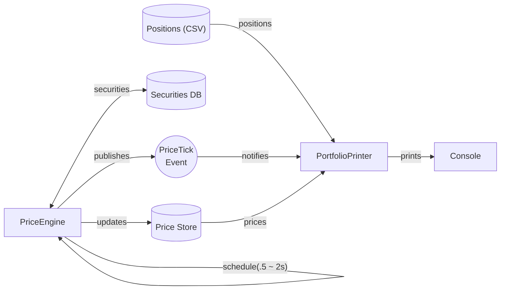

# Portfolio

### Components

1. All positions are read from a CSV file and are loaded into the `PortfolioPrinter` when the
   application starts.
    1. In reality, this would be from some dynamic source.
2. The `PriceEngine` schedules price ticks for all securities in the system, using Spring's
   out-of-the-box scheduler.
3. Each tick updates the `PriceStore` with the new price information in an atomic fashion (all
   options for a stock are updated in a single transaction).
4. A `PriceTickEvent` is published to all subscribers (in this case, only `PortfolioPrinter`)
5. On receipt of a `PriceTickEvent`, the `PortfolioPrinter` reads from the `PriceStore`, and prints
   the updated portfolio and its value to the console.
6. The components are wired together using Spring's IOC container, each behind interfaces to allow
   swapping out of implementations.

I designed this app largely with the following patterns in mind:

- CQRS; for separation of concerns between reading (`PortfolioPrinter`) and writing (`PriceEngine`)
    - Each component has a single responsibility
    - The readers and writers to the `PriceStore` are decoupled and can be scaled independently
- Event-driven
    - Akin to a pub-sub model, the `PriceTickEvent` is published to all subscribers, to simulate a
      real-world price publishing system where multiple consumers can subscribe to and act on
      changes in state.

### Price Engine

- The most complex component in the system it is responsible for:
    - Simulating stock price ticks over a random time interval (between 0.5s to 2s)
    - Persisting price information
    - Implementing mathematical models for generating stock prices
    - Providing appropriate interfaces for consumers to subscribe to price ticks
- As the number of stocks increase, the number of writes to the price store increases linearly
  in the order of n * m, where n is the number of stocks and m is the number of options per stock.
- When a stock price ticks, all of its options should be updated in a single atomic transaction to
  ensure that consumers of the price store don't see partial updates and read inconsistent data.
- For the sake of simplicity, the price engine implemented for this assignment uses a single thread
  to simulate stock price ticks, leveraging Spring's async capabilities to schedule the writes in a
  non-blocking manner.
- In a real application, the writes to the `PriceStore` can be scaled horizontally by spinning up
  more threads / workers.

#### PriceTickEvent

- A simple event object that encapsulates information about a stock price tick.
- This is written in an event-driven manner to:
    - Decouple the `PriceEngine` from the `PortfolioPrinter`
    - Allow for multiple subscribers to the event in the future
    - Leverage Spring's async capabilities and abstractions instead of hand-rolling inter-thread
      communication

#### PortfolioPrinter

- A simple component that listens for `PriceTickEvents`, reads the latest prices from `PriceStore`
  and prints the updated portfolio to the console.

#### Testing Strategy

- Some tests have been written demonstrating the typical unit testing strategy.
- Bulk of the testing is focused on the `PriceEngine` given that it contains the bulk of the
  business logic.
- To test `GeometricBrownianMotion`, we initialize a static RNG (in the test only) with a fixed seed
  and compare
  the output with expected values.

### Follow-ups / Improvements

- To avoid IEEE-754 floating point precision issues, we can use `BigDecimal` for storing prices.
- The `PriceEngine` can be scaled horizontally by spinning up more threads / workers to perform
  price ticks for multiple stocks in parallel.
- The `PriceStore` could be replaced with a durable, performant data store like Redis to provide
  quick look-ups and atomic writes.
    - Different architectures and data fetching / eager loading strategies can be explored if more
      extreme performance demands is required.

---

## Running the application

#### (Recommended) via IDE

1. Import the project into your favorite IDE (IntelliJ IDEA, Eclipse, etc.)
2. Run the `main` method in `PortfolioApplication`

#### via command line

1. Run `./gradlew bootRun` from the root of the project

